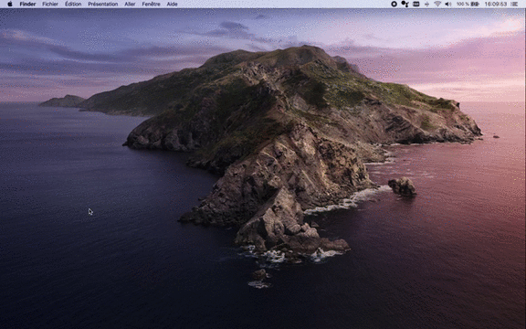

# Google Assistant for Mac

[Download latest version for Mac](https://github.com/maximeallanic/google-assistant/releases/latest/download/Google%20Assistant.dmg)

## Functionnality
- All google assistant's locals are available
- Answers use your mac location
- Use Cmd+U to launch it and you can change it on parameters
- Start at login automatically

## Thanks

- [endoplasmic](https://github.com/endoplasmic/google-assistant) for SDK Google Assistant
- [Willmer Barahona](https://codepen.io/wbarahona/pen/Lyvedy) for Google Assistant animation
- [AnimeJS](https://animejs.com/) for animation
- [Electron](https://www.electronjs.org/)
